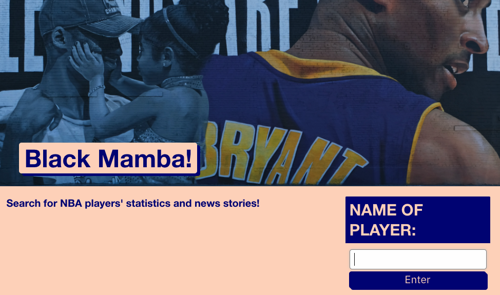

# Black Mamba



## Deployed application:
https://ellysecarter.github.io/black-mamba/

## User Story

```
AS A NBA fan
I WANT an app that can search players' stats and news stories,
SO THAT so that I can keep up with the latest NBA news.
```

## Table of Contents
* [Technologies used](#technologies-used)
* [Features](#features)
* [Known bugs](#known-bugs)
* [Images](#stock-images-provided-by)
* [Contributors](#contributors)


## Technologies Used
* HTML
* CSS
* JavaScript
* Bootstrap
* Foundation
* [API-NBA](https://api-sports.io/documentation/nba/v2)
* [GNews](https://gnews.io/)


## Features
* Start by typing in a NBA Player's name.
* It will then populate that player's stats
* It will also provide news stories associated with that player

## Known Bugs
* API-NBA and GNews both have a daily quota of 100 API calls. If you search for a player and it does not populate a result, it is because we have hit our daily limit of 100 requests. 


## Stock images provided by:
* [Mike Von](https://unsplash.com/photos/Q-3AcRtqoqM)


## Contributors
* Ellyse Carter [@ellysecarter](https://github.com/ellysecarter)
* Tianchou Gong [@GongTianchou](https://github.com/GongTianchou) 
* Vishal Mangla [@vishalmangla](https://github.com/vishalmangla) 
